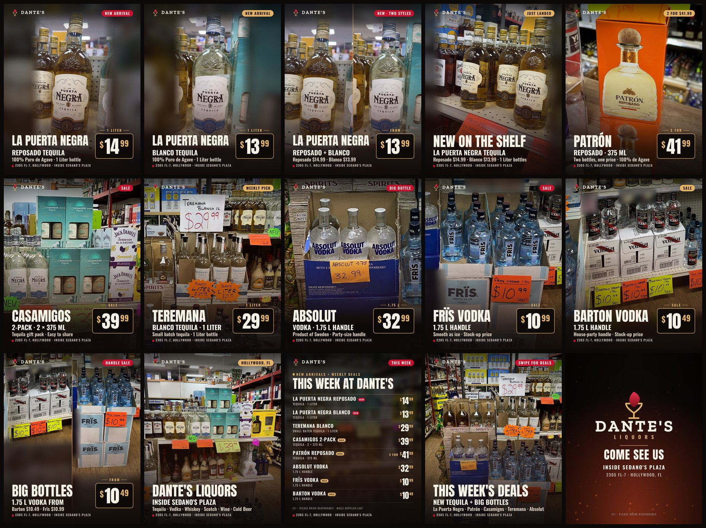

# Dante's Liquors · Ad Set: New Arrivals + Weekly Deals



These ads were rendered with [Dante's Ad Forge](https://premohq.github.io/DAF/) from in-store photos. Captions, hashtags, alt text, and a 2-week posting plan are in **[`social-media-descriptions.txt`](social-media-descriptions.txt)**.

| # | Ad | Price |
|---|---|---|
| 01 | La Puerta Negra Reposado 1 L | $14.99 · NEW |
| 02 | La Puerta Negra Blanco 1 L | $13.99 · NEW |
| 03 | La Puerta Negra Reposado + Blanco (split) | from $13.99 |
| 04 | New on the Shelf (teaser) | no price card |
| 05 | Patrón Reposado 375 mL | 2 for $41.99 |
| 06 | Casamigos 2-Pack (2 × 375 mL) | $39.99 · SALE |
| 07 | Teremana Blanco 1 L | $29.99 |
| 08 | Absolut Vodka 1.75 L | $32.99 |
| 09 | Frïs Vodka 1.75 L | $10.99 · SALE |
| 10 | Barton Vodka 1.75 L | $10.49 · SALE |
| 11 | Handle Sale: Barton + Frïs (split) | from $10.49 |
| 12 | Visit Dante's (store/brand) | no price card |
| 13 | Weekly deals price list | all 8 prices |
| 14 | Carousel cover + closing slides | n/a |

## Files in each folder

| File | Size | Use for |
|---|---|---|
| `feed_4x5.jpg` | 1080×1350 | Instagram / Facebook feed (recommended) |
| `square_1x1.jpg` | 1080×1080 | Grid, Facebook, Google Business Profile |
| `story_9x16.jpg` | 1080×1920 | Stories, WhatsApp Status |
| `reel_9x16.mp4` | 1080×1920, 30 fps | Reels / TikTok / Shorts (silent, so add a sound in-app) |
| `wide_16x9.jpg` | 1920×1080 | X, Facebook link posts |
| `window_display_3840x2160.png` | 3840×2160 | In-store window monitors (rotated landscape layout) |

## What changed from a plain Forge export

Every ad uses the Forge's own renderer (Inferno treatment, embers, header, price card, and window-display format). The build adds:

- **Pre-cropped, sharpened photos.** Crops are done in full resolution with Lanczos resampling and light sharpening, so the Forge draws each photo 1:1 instead of stretching it in the browser.
- **Whole-product framing.** Each product fits completely in the clear space between the header and the text, so no bottle tops are cut off and nothing is buried under the price card. Where a photo runs out, a blurred extension of the scene fills the edge.
- **Stray tags removed.** Other products' handwritten price tags, and printed box text that sat under a headline, are blurred and muted. For example, the Frïs ad no longer shows the Teremana "$29.99" stars.
- **Price-card captions** ("2 FOR", "SALE", "FROM", "1 LITER") above the gold price card.
- **Split-screen layouts** for the Reposado + Blanco and Barton + Frïs ads.
- **Product panels** for 16:9 and some Reels: a sharp product shot over a blurred copy of the scene, instead of a blurry upscaled crop.
- **New layouts:** the weekly price list (with animated rows in the Reel) and a centered Dante's Liquors closing slide.
- **Smooth videos.** Reels are rendered frame by frame at 30 fps and encoded as H.264 MP4, instead of being screen-recorded in real time.

## Rebuilding (for new prices or photos)

`_build/` has the source photos and scripts: `concepts.json` for products, prices, copy, and crops; `prep.py` for photo prep; `ext.js` for the engine add-ons; `run.js` to drive the live Forge; and `finish.py` to export JPGs and the overview. It needs Python with Pillow, Node with Playwright, and ffmpeg:

```sh
cd ads/_build
python3 prep.py                 # crop + enhance photos -> prep/
node run.js all                 # render via the live Forge -> out/
python3 finish.py               # JPG/PNG/MP4 into ads/<concept>/ + overview.jpg
```
